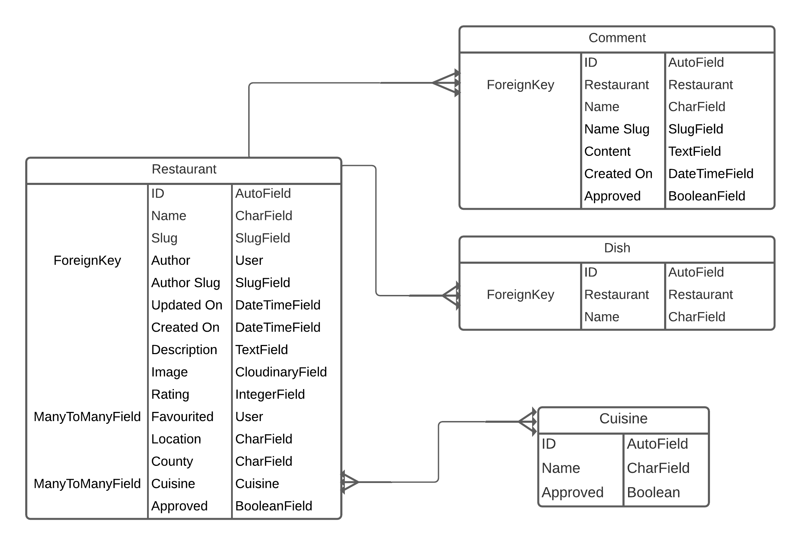
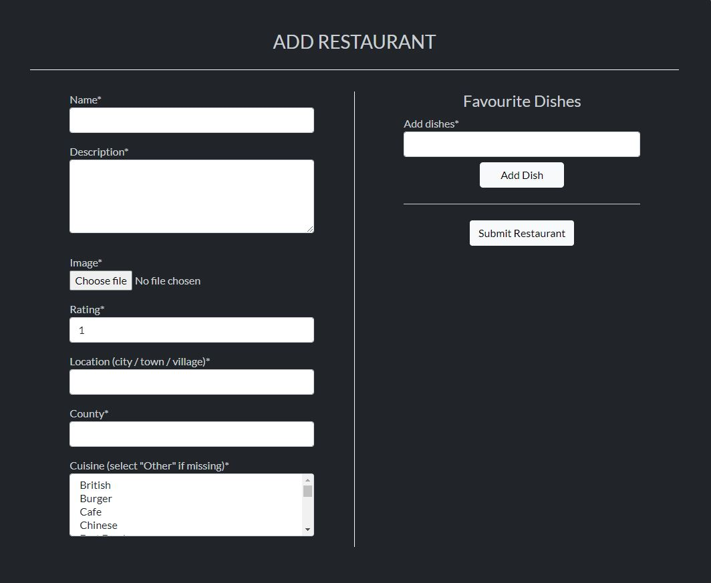

# Foodie Favourites

[Click here to view the live site.](https://foodie-favourites.herokuapp.com/)

## Contents

- [Overview](#overview)
- [User Experience (UX)](#user-experience)
    - [Strategy](#strategy)
    - [Scope](#scope)
    - [Structure](#structure)
    - [Skeleton](#skeleton)
    - [Surface](#surface)
- [Features](#features)
    - [Existing Features](#existing-features)
- [Testing](#testing)
    - [User Stories Testing](#user-stories-testing)
    - [Validator Testing](#validator-testing)
    - [Performance Testing](#performance-testing)
    - [Device and Browser Compatibility Testing](#device-and-browser-compatibility-testing)
    - [Bugs](#bugs)
- [Deployment](#deployment)
- [Technologies Used](#technologies-used)
    - [Languages](#languages)
    - [Online Resources](#online-resources)
- [Credits](#credits)
    - [Code](#code)
    - [Media](#media)

## Overview

Foodie Favourites is a free to use website where UK based food lovers - especially those who enjoy eating out - can share and discover their favourite restaurants and dishes. Once registered, users can create posts of their own favourite restaurants, and can comment and favourite other peoples' restaurant posts. Registered users will have their own profile page where they can share some infomation about themselves if they so desire. The profile page also shows any restaurant posts they have made, and any restaurants they have favourited.

## User Experience

### Strategy

This website is aimed at people who would like to share their favourite restaurants with others, and/ or people who would like to discover some new restaurants. Therefore the age range aimed for is quite wide, essentially anyone who is able to enjoy a nice meal out.

In a very broad sense, their are 3 types of users the website will have: site admins, registered users and non-registered users. For this reason the epics and user stories have been categorised in this way.

#### Epics and User Stories

There are 3 epics, each of which have been split up into multiple user stories. All of which are outlined below.

More detail about the user stories including acceptance criteria and tasks associated with each of them can be found in the [issues](https://github.com/AshFoster/foodie-favourites/issues) section of the GitHub repository.

  - __Epic 1: Admin Setup__
      - As a Site Admin I can create, read, update and delete restaurant posts so that I can manage the site's content
      - As a Site Admin I can approve or disapprove comments on restaurant posts so that I can filter out any questionable comments
      - As a Site Admin I can be notified when a comment needs to be approved so that I do not need to keep checking the admin site for anything to be approved
      - As a Site Admin I can be notified when a user has submitted the contact form so that I do not need to keep checking the admin site for any form submissions to read

  - __Epic 2: All User Functionality__
      - As a Site User I can view a list of restaurant posts so that I can select one to view
      - As a Site User I can view a paginated list of restaurant posts so that I can easily select a post to view
      - As a Site User I can filter the available restaurant posts so that I can see posts which are more specified to my needs
      - As a Site User I can type keywords into a search bar so that I can find restaurant posts with titles that contain the keywords that I typed
      - As a Site User I can click on a restaurant post so that I can view the post in its entirety
      - As a Site User I can view the number of times a restaurant post has been favourited so that I can I can see which are the most popular
      - As a Site User I can view comments on an individual restaurant post so that I can I can see what people have had to say about it
      - As a Site User I can view the author's favourite dishes on each individual restaurant post so that I can see which dishes the author of each restaurant post recommends
      - As a Site User I can view registered users' profiles so that I can learn more about them and see which restaurant posts they've favourited and/or which they've posted.
      - As a Site User I can fill in a contact form so that I can get in contact with the site owners to ask any questions I might have
      - As a Site User I can register for an account so that I can contibute to the site

  - __Epic 3: Registered User Functionality__
      - As a Registered Site User I can add my own restaurant posts so that I can share my favourites restaurants and dishes with other users
      - As a Registered Site User I can update restaurant posts that I've previosuly made so that I can amend anything that might be incorrect or add dishes
      - As a Registered Site User I can delete restaurant posts that I've previosuly made so that I can remove any restaurant posts that I no longer wish to share
      - As a Registered Site User I can leave comments on restaurant posts so that I can give my opinion on posts
      - As a Registered Site User I can favourite or unfavourite restaurant posts so that I can keep track of restautant posts that I like
      - As a Registered Site User I can reset my password so that I can still gain access to my account if I've forgotten the current one
      - As a Registered Site User I can update my registered email address or update my password so that I can use a new email address with my account, strengthen my password or user a more memorable password
      - As a Registered Site User I can view my own profile so that I can see what restaurant posts I've posted or favourited
      - As a Registered Site User I can edit my own profile so that I can choose what to share about myself with other users

### Scope

All of the user stories outlined above are all feassible for the first release of the website. Some further features that could be implemented later on include:

- Allowing users to suggest their favourites dishes on other user's restaurant posts
- Adding an autocomplete feature to the location selection when adding a new restaurant
- Giving the user the ability to explicitly request new cuisines (this can currently be done using contact us page)

I don't feel that having these features will impact the user experience too much, so felt it was fine to exclude them for the first release. Each of which would need to be thought about carefully in how they would be implemented in order to not overcomplicate the website too much.

### Structure

The structure of the website is aimed to be as simple as possible whilst showing all the necessary information. The main parts of the site will be accessible from the navbar, with any other parts easily accessible from the relevant pages. The main parts of the site included within the navbar are as follows:

- Home
- Restaurants (where all restaurant posts can be found)
- Contact Us
- Sign In
- Register
- Profile (registered users only)
- Sign Out (registered users only)

Other parts of the site not included in the navbar are as follows:

- Restaurant detail (accessed from restaurants page and users' profile pages)
- Add Restaurant (registered users only - accessed from home page and restaurant page)
- Update Restaurant (registered users only - accessed from restaurant detail page - only post's author can access)
- Delete Restaurant (registered users only - accessed from update restaurant page - only post's author can access)
- Other users' profiles - accessed by clicking on the author's username on restaurant posts or comments
- Edit profile (registered users only - accessed from profile page - users can only edit their own profiles)
- Update Email (registered users only - accessed from profile page - users can only update their own email)
- Update Password (registered users only - accessed from profile page - users can only update their own password)
- Reset Password (registered users only - accessed from sign in page - users can only reset their own password)

The site has been split up into 3 apps: restaurants, accounts and contact. With the restaurants app handling everything to do with displaying, adding, updating, deleting and interacting with restaurant posts. The accounts app handles everything to do with user accounts and profiles, and the contact app handles the contact form.

The site map can be seen in the following image:

#### Data Models

##### Restaurants App Models

The restaurants app has 4 database tables associated with it: Restaurant, Cuisine, Comment and Dish.

The Restaurant table has relationships with all of the other tables: Cuisine being a many to many relationship, Comment being a one to many relationship, and Dish also being a one to many relationship (many comments and many dishes can be associated with one restaurant). Each table has some of their own other fields, too. The restaurant table also has a one to many relationship and a many to many relationship with Django's built in User model: the author field and the favourited field respectively.

All of which can be seen in the image below.

##### Accounts App Models

The accounts app has a single database table associated with it: Profile. This has a one to one relationship with Django's built in User model, and adds some more fields to be used on the user's profiles. The image below shows how this table is structured.

### Skeleton

#### Wireframes

Wireframes were created for mobiles, tablets, and desktops using [Balsamiq](https://balsamiq.com/). The actual pages do differ slightly from the original wireframes.

Here are links to each of them:

- [Desktop - Home](assets/wireframes/home-desktop.png)
- [Tablet - Home](assets/wireframes/home-tablet.png)
- [Mobile - Home](assets/wireframes/home-mobile.png)
- [Desktop - Restaurants](assets/wireframes/restaurants-desktop.png)
- [Tablet - Restaurants](assets/wireframes/restaurants-tablet.png)
- [Mobile - Restaurants](assets/wireframes/restaurants-mobile.png)
- [Desktop - Contact](assets/wireframes/contact-desktop.png)
- [Tablet - Contact](assets/wireframes/contact-tablet.png)
- [Mobile - Contact](assets/wireframes/contact-mobile.png)
- [Desktop - Sign In](assets/wireframes/sign-in-desktop.png)
- [Tablet - Sign In](assets/wireframes/sign-in-tablet.png)
- [Mobile - Sign In](assets/wireframes/sign-in-mobile.png)
- [Desktop - Register](assets/wireframes/register-desktop.png)
- [Tablet - Register](assets/wireframes/register-tablet.png)
- [Mobile - Register](assets/wireframes/register-mobile.png)
- [Desktop - Restaurant Detail](assets/wireframes/restaurant-detail-desktop.png)
- [Tablet - Restaurant Detail](assets/wireframes/restaurant-detail-tablet.png)
- [Mobile - Restaurant Detail](assets/wireframes/restaurant-detail-mobile.png)
- [Desktop - Add Restaurant](assets/wireframes/add-restaurant-desktop.png)
- [Tablet - Add Restaurant](assets/wireframes/add-restaurant-tablet.png)
- [Mobile - Add Restaurant](assets/wireframes/add-restaurant-mobile.png)
- [Desktop - Profile](assets/wireframes/profile-desktop.png)
- [Tablet - Profile](assets/wireframes/profile-tablet.png)
- [Mobile - Profile](assets/wireframes/profile-mobile.png)

### Surface

#### Imagery

Images are an important part of the look and feel of the website. Each page has a different background image, most of which are of different restaurant settings.

#### Colour Scheme

The colour scheme of the site is very simple, with the main colour's being shade's of black, grey, and white.

The idea was to keep the colours themselves simple, and to use the different background images on each page to provide the more interesting colours. Using shades of black, grey and white meant that most images could be used without clashing.

#### Typography

For the typography choices, [Google Fonts](https://fonts.google.com/?sort=popularity) was used, sorted by popularity to give an idea of some fonts that are likely to work well across a number of websites.

The ones that stood out and seemed most suited to the project were chosen. They are as follows:

Open Sans Condensed (italic) - This is used for the Foodie Favourites logo shown on the navbar.

Oswald - This is used for all navbar links. 

Lato - This is used for all other text throughout the site.

Each of them is of the font category Sans Serif which is the font used as a fallback if for any reason the specified font isn't available.

## Features

### Existing Features

- __Navbar__

  

  - Tha navbar has the website brand on the left-hand side which is also a link to the homepage. It also has links to all the major sections of the website.
  - When on each of the major sections of the site the relevant link is bold and brighter to show the user which part of the site they're currnently viewing.
  - When signed in, the section on the right-hand side showing Sign In and Register changes to Profile and Sign Out respectively.
  - The menu items on the right are displayed as a hamburger item on smaller screens which when pressed opens up a menu with all the links below.

- __Footer__

  

  - The footer is split up into 2 main sections. One that shows a small paragraph describing what Foodie Favourites is all about, and the other showing links to various social platforms.
  - There is a also smaller section which simply shows a copyright related information.

- __Welcome Message__

  

  - Here, the user is welcomed to the site with a brief description of what the site is aimed to do.
  - If the user is signed in then the welcome message displays their username.
  - On the right-hand side the user is invited to sign in or register via some links.
  - If the user is already signed in the message on the right invites them to have a look at the current list of restaurants instead.

- __Recently Added Restaurants__

  

  - This section show the 2 most recently added restaurants which the user can click on the be taken to the relevant restaurant's detail page.
  - There is also a link below these items which takes the user to the full list of restaurants.
  - If the user is signed in then there is also an 'Add Restaurant' button which takes the user to the add restaurant page.

- __Sign In__

  

  - The Sign In page asks the user for their username and password in order for them to sign in.
  - There is a 'Sign In' button below the form which submits the form.
  - If the username or password is incorrect the user is told.
  - All fields needs to be completed and if any are not the user will be asked to complete the empty fields.
  - There is also a 'forgot password' link which takes the user to a the 'Reset Password' page.
  - There is a 'Register' button which takes the user to the 'Register' page.

- __Register__

   

  - The Register page asks the user for an email address, a username, a password and to repeat the password.
  - There is a 'Register' button below the form which submits the form.
  - If the email address or username already exists the user is told, and must use another email address and/or password.
  - If the repeated password does not match the first one the user is told, and will need to type them in again.
  - All fields needs to be completed and if any are not the user will be asked to complete the empty fields.
  - There is a 'Sign In' button which takes the user to the 'Sign In' page.

- __Restaurants List__

  

  - The restaurants list displays all of the current restaurant posts.
  - It is paginated to show 3 restaurants per page, with buttons at the bottom which take the user to the next or previous page where necessary.
  - Each restaurant post shows the name, author, cuisine, location, number of times favourited, and the author's personal rating (from 1 to 5) of the restaurant. 
  - There is a search bar above the restaurant posts which allows the user to search for restaurants with titles that contains their search criteria.
  - If the user is logged in, there is an 'Add Restaurant' button above the Restaurants List section which takes the user to the add restaurant page.

- __Filters__

  

  - The filters section displays lists of all the different cuisines and locations of all the current restaurants.
  - Next to each cuisine and location a number is displayed on the right-hand side showing how many restaurants match that particular cuisine or location.
  - When the user clicks on one of the cuisines or locations the restaurant list is immedietely filtered and reloaded based on the what has been clicked.
  - When filtered on a cuisine, the location list is updated to show only locations that match the selected cuisine and vice versa.
  - Both cuisine and location lists are also updated appropriately when the user uses the search bar above the restaurants list described above.
  - When viewing on smaller screens the filters section is hidden and a 'Filters' button is shown instead. When clicked, a modal containing the filters section is shown. 

- __Contact Form__

  

  - The contact form allows the user to contact the admin of the site.
  - It has 3 required fields, name, email and message. If any of them have been missed on submission the user is told.
  - If the user is signed in then the name and email fields will already be completed using information from their account.

- __Profile__

  

  - Each registered user is given a profile page which can be viewed by registered and non-registered users.
  - Users can view other users' profiles by clicking on the user's name that is displayed on restaurant posts or comments that that user has made.
  - Registered users can view their own profile by clicking on the profile link in the navbar.
  - On all profiles there is a 'Profile Info' section which has 5 fields, name, location, favourties cuisine, bio and image. The name field is automatcally completed using the user's username, but can be updated by the user to their real name if they wish to. All other fields except image are blank until the user decides to fill them in, the image field having a default image until one has been added.
  - There is also a 'Restaurants Posted' section that displays all of the restaurants that user has posted. Within this section a 'Show Favourites' button is shown which changes the 'Restaurants Posted' section to 'Favourited Posts' which shows all the posts which the user has favourited. When viewing the 'Favourited Posts' section the button now shows 'Show Restaurants Posted' which reverts back to show the 'Restaurants Posted' section.
  - When user's are viewing their own profile there are some extra features. There is an 'edit' button within the 'Profile Info' section which takes the user to a page where they can edit the information that is shown on their profile. There are also 'Update Email' and 'Update Password' buttons which take the user the different pages where thay can change the email address registered with their account, or change their current password.

- __Add Restaurant__

  

- __Update Email__

  

- __Change Password__

  

- __Reset Password__

  

- __Sign Out__

  

## Testing

### User Stories Testing

### Validator Testing

- __HTML__

  - [W3C Markup Validation Service.](https://validator.w3.org/)

- __CSS__

  - [W3C CSS Validation Service - Jigsaw.](https://jigsaw.w3.org/css-validator/)

- __JavaScript__

  -  [JSHint.](https://jshint.com/)

- __Python__

  - [PEP8 linter](http://pep8online.com/)

### Performance Testing

I audited the website for mobile and desktop using Google Chrome's lighthouse feature. All scores were high. It might only be examing the landing page and not the in-game page.

The final lighthouse scores are as follows:

  - Mobile

  

  - Desktop

  

[WAVE Evaluation Tool](https://wave.webaim.org/)

### Device and Browser Compatibility Testing

To test the site's compatibility across a range of devices I used [Responsinator](https://www.responsinator.com/) and went through all of the user and owner goals on each device it includes in both portrait and landscape modes. The devices included are as follows:

  - iPhone X
  - Pixel 2
  - iPhone 6-8
  - iPhone 6-8 Large Version
  - iPad

Chrome Dev Tools was also used to check the site's compatibility across a range of other devices also in both portrait and landscape modes. These devices include:

  - Ipad Pro
  - Galaxy Fold (which has a very narrow viewport of only 280px in portrait mode)

Actual mobile devices belonging to family and friends were also used for testing which includes the following:

  - iPhone 7
  - Pixel 4
  - S10 Plus

A desktop monitor was also used for testing with a couple of different resolutions to check that the site remains to look and act as expected on larger screens. The resolutions were: 1366 x 768 and 1920 x 1080.

Google Chrome was the browser used for the majority of testing during the development process, but once development had neared an end some other browsers were used for testing to make sure the site had cross-browser compatibility. The full list of browsers used for testing are as follows:

  - Chrome
  - Internet Explorer 11
  - Edge
  - Firefox

### Bugs

#### Fixed Bugs

- When submitting the add restaurant form the Cuisine field wasn't being saved to the database. This was a problem because it is a required field. This was caused due to the use of 'commit=False' when initially saving the form data, and the Cuisine being a many to many relationship with Restaurant. It was fixed by saving the form using Django's save_m2m() function on the form straight after the Restaurant's object data was saved.

- When updating a restaurant post the dishes get added again when submitting the form. This was solved by deleting all of the current dishes related to the relevant restaurant and then adding the new list of dishes which may or may not contain the original dishes.

- The height of the restaurnt previews on the home page and restaurant page varied based on the height of the images uploaded so different restauarant cards weren't always the same height. This was fixed by amending the y margins on the relevant elements and adding some custom height classes at certain screen widths. One of the custom classes forces the element to be 100% height at certain screen widths, and an other forces the height of the elements to be 250px at certain screen widths.

- When submitting the filter form on restaurants.html it did not work when submitting via the modal, but did when not submitting via the modal. This was fixed by submitting the form using Javascript, which is a requirement when using Bootstrap modals.

- When adding pagination to profile.html it wasn't working initially. It was eventually fixed by using page_obj.object_list as the context to be looped over rather than the context that was explicitly defined in ProfileView.

- Custom box shadow is applied to the welcome message area which still appears on smaller screens even though the element's background is transparent on smaller screens. This was solved by adding custom class names to the relevant elements and then adding box shadows using media queries.

- Any logged in user can access the edit and delete pages of any restaurant, and the edit page of any user's profile if they type in the correct url. This was fixed by overiding the get_queryset funcion of the relevant views and returning only objects which the current user is associated with.

- When deplying to Heroku for the first time the background images applied to divs via the css file were not loading. This was fixed by uploading all of the images to Cloudinary and then referencing the urls given to them by Cloudinary in the css file.

- When uploading an image to a profile the image was not displaying correctly. This was caused by an if statement being in the wrong place in profile.html. This was easily rectified by moving the if statement to the correct place.

#### Unfixed Bugs

- When adding a restaurant, if a restaurant with the same name already exists an error is thrown as expected. But when the form is reloaded the list of dishes added before submission disappear.

- When viewing the forms to add a restaurant or to update your profile, on very small screens (below 360px wide) the image upload element becomes too wide and is not contained within its parent element.

## Deployment

[Here's a link to the live site.](https://foodie-favourites.herokuapp.com/)

### Deploying with Heroku

This project has been deployed on Heroku using the following steps:
 
- Log into Heroku or create an account.
- Create a new Heroku App with an approriate name and region.
- Once created go to Resources tab, then under Add-ons search and add 'Heroku Postgres’.
- Then go to the Settings tab and click Reveal Config Vars.
- Add the following variables as config vars:
  - SECRET_KEY - can be any key you like
  - CLOUDINARY_URL - must be a Cloudinary API key
  - SENDGRID_API_KEY - must be a SendGrid API key
  - EMAIL_HOST_USER - must be the email address associated with SendGrid account
- Now go to the Deploy tab.
- Connect to Github using the relevant repository name.
- Then click 'Deploy a GitHub branch' under the Manual deploy section.
- Once confirmation of deployment is shown, the project is now deployed and can be opened.

### Forking or Cloning the GitHub Repository

To deploy this application, fork or clone the [repository](https://github.com/AshFoster/foodie-favourites), then follow the steps outlined in the '[Deploying with Heroku](#deploying-with-heroku)' section above.

Steps to do so are shown below.

When deploying using a fork or clone, all of the apps in the 'requirements.txt' file will need to be installed.

#### Forking the Repository

To fork the GitHub repository follow these steps:

- Log in to GitHub and navigate to the [repository](https://github.com/AshFoster/foodie-favourites).
- Once the page has loaded look for the "Fork" button near the top right of the page and click it.
- A copy of the original repository should now be in your GitHub account.

#### Cloning the Repository

To clone the GitHub repository follow these steps:

- Log in to GitHub and navigate to the [repository](https://github.com/AshFoster/foodie-favourites).
- Above the repository's list of files, on the right, click on the "Code" button.
- Copy the link that is shown in the drop-down list.
- Open Git Bash and change the current working directory to the location where you want the cloned directory to be made.
- In the terminal, type `git clone`, and then paste the URL you copied earlier and press enter.
- A local clone of the original repository should now be available.

## Technologies Used

### Languages

- [HTML5](https://en.wikipedia.org/wiki/HTML5)
- [CSS3](https://en.wikipedia.org/wiki/CSS)
- [JavaScript](https://en.wikipedia.org/wiki/JavaScript)
- [Python](https://en.wikipedia.org/wiki/Python_(programming_language))

### Frameworks

- [Django](https://www.djangoproject.com/)
- [Bootstrap 5](https://getbootstrap.com/)

### Online Resources

- [Git](https://en.wikipedia.org/wiki/Git) - for version control.
- [GitPod](https://www.gitpod.io/) - the online IDE (Integrated Development Environment) used for development.
- [GitHub](https://github.com/) - used as an online code repository and for deployment.
- [Google Fonts](https://fonts.google.com/) - for the fonts used throughout the site.
- [Font Awesome](https://fontawesome.com/) - for the icons used throughout the site.
- [Online Image Resizer](https://resizeimage.net/) - for resizing images to improve the site's performance.
- [Eye Dropper](https://eyedropper.org/) - to find the hex code for the game images colour.
- [Adobe's Colour Wheel](https://color.adobe.com/create/color-wheel) - to find the contrasting colours throughout the site.
- [Colormind](http://colormind.io/) - used to obtain colour palette images.

## Credits

### Code

- [YouTube](https://www.youtube.com/)
- [Code Institute's Full Stack Developer Course](https://codeinstitute.net/)
  - Course material and essentials walkthrough projects provided some ideas.

### Media
